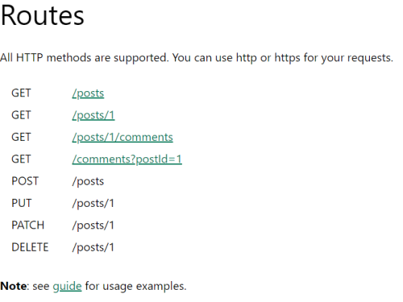

# Functional Guide to APIs
Everything you need to use and understand APIs.

## What is an API?
API stands for **A**pplication **P**rogramming **I**nterface.

An API is an interface into a software application that is typically accessed by another software application rather than manually. Chances are good that you've utilized many an API in the course of browsing the internet without even realizing it!

An API defines a set of routes or endpoints, which can be thought of as addresses, that enables specific communication with the software application behind it. A well made API provides a constrained and safe gateway to the internals of a system.

By itself the API does not do anything, but by sending it the proper messages the API can kick off back-end processes, store data that came with the message, and/or return data from a database.

An API can be set up to only allow authorized sources or individuals to access it, or it can be made available to the public by way of the internet.

A common type of API is called a REST API, or RESTful API. REST stands for **RE**presentational **S**tate **T**ransfer and is simply an API architecture, or a specific way to build APIs. This is useful because if there were no agreed upon standards then every API would be completely unique and require unique implementations to interface with it. By working within the standard the API becomes much more accessible.

[Learn more about RESTful APIs here.](https://developer.mozilla.org/en-US/docs/Glossary/REST)

## Where are APIs used?
APIs are used almost everywhere on the internet! Anywhere there is a transfer of data between a client and a server, such as an internet browser and a website's back-end, an API of some variety will most likely be used. APIs are also used for communication between backend systems, since an API constrains the potential interactions to only what is allowed, making for simple communication that does not require knowledge of the underlying system.

Note: The contents of static websites come from webservers, as they do not change once provided, but any additional data transfer will use an API.

Examples include submitting log in details to a website, posting a comment on social media, scrolling through a list that continually updates, or looking at a website with data that stays up to date each time you load it, such as weather forecasts. A less visible example would be algorithmic trading, where software algorithms submit thousands of API requests every second to buy and sell financial assets.

## How do I use an API?
APIs are accessed through specifically formed messages that correspond specifically to the way the API was made. To utilize a specific API you will need to look at that specific API's documentation.

The messages used to communication with a RESTful API are almost always HTTP requests, which stands for **H**yper**T**ext **T**ransfer **P**rotocol, though there are exceptions. That's why reading the specific documentation is so important!

[Learn more about HTTP requests here.](https://developer.mozilla.org/en-US/docs/Web/HTTP/Methods)

HTTP requests can be sent in many ways, such as command line tools, programming libraries, and software applications.

After sengin an HTTP request an HTTP response is returned. These can indicate that everything worked, such as a `200 OK` response, or indicate what in particular went wrong, such as a `400 Bad Request` response.

[Learn more about HTTP responses here.](https://developer.mozilla.org/en-US/docs/Web/HTTP/Status)

### Example

The website https://jsonplaceholder.typicode.com/ provides a simple public example API.

Below are the routes provided.

Notice how the routes all start with `/`. This is because they are specified after the website address.

An ordinary web browser can be used to test the GET routes, as the act of going to any website is actually sending a HTTP GET request to the provided address and displaying what returns.

Rather than a regular website, we see the JSON data returned by the API's `/posts` route. JSON stands for **J**ava**S**cript **O**bject **N**otation, and is a widely used format for both sending and receiving data through APIs due to the fact that it is easily read by humans as well as machines.

[Learn more about JSON here.](https://developer.mozilla.org/en-US/docs/Learn/JavaScript/Objects/JSON)

The above request returned every post in the system, but if this were a real API with a massive dataset behind it there might be a return limit in place. If we wanted to see a single post based upon its id, we could send a HTTP GET request to the route `/posts/{id}`, where `{id}` is the id number of the post we want to get, as seen below.

By specifying the data we want from the API we save ourselves the trouble of sorting through all the posts we didn't want. Always look to the documentation for specifics on what data a route expects and returns.

The other types of routes work in much the same way, often requiring some additional information included with the request, such as the new or updated information for POST/PUT requests or the id of a comment to DELETE.

The tool [Postman](https://www.postman.com/) can be used to easily form and send HTTP requests as well as other formats of API messages for the purpose of API testing.

As we can see above, the body of the PUT request was filled out with an `id`, `title`, `body`, and `userId`. The header was also filled in accord with the specifications of the documentation. As a result, on the bottom third of the Postman screen, we received a `200 OK` response with the JSON id of the updated entry after a brief 294 millisecond wait.

## How do I know if an API exists?

The only official way to know is to look at any provided documentation, but sometimes undocumented API routes are discovered by intrepid explorers. This goes to show, if you are building a public API, ensure only the routes you intend are accessible by the public.